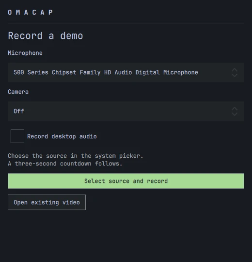
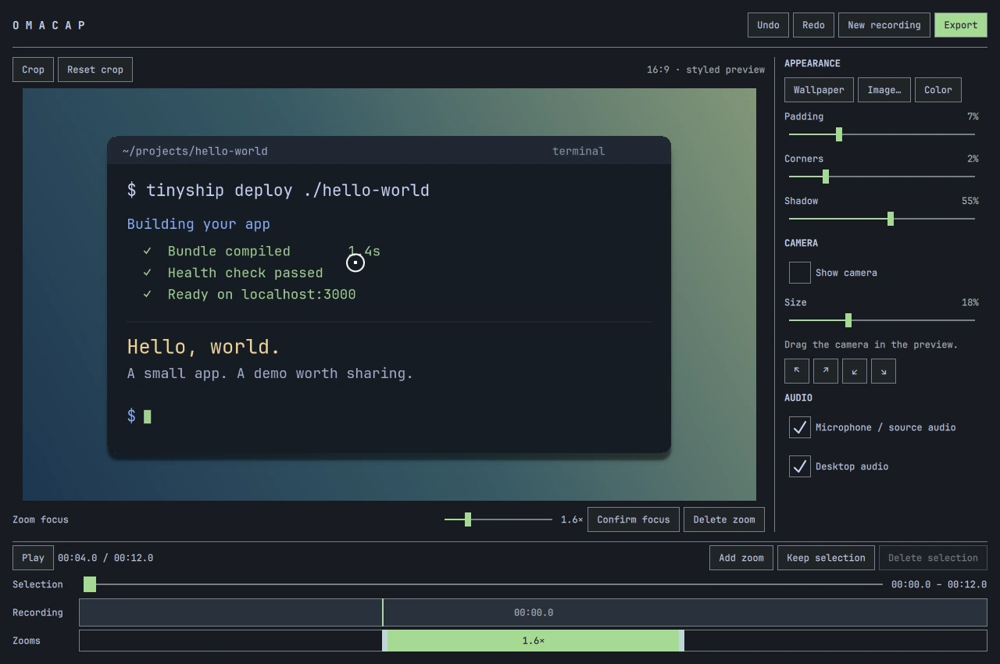
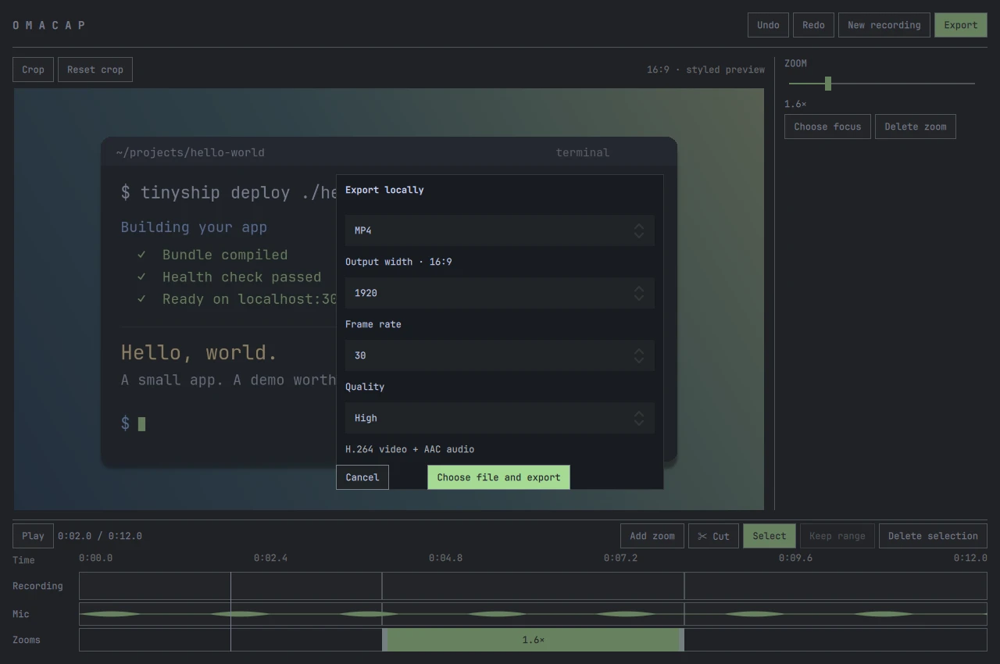

# OmaCap

Screen recordings worth sharing. Made for Omarchy.

Record a window, clean up the take, and give it a background, padding and smooth zooms. Export an MP4 or GIF for a demo, tutorial or product update. Everything stays on your computer.

[Install](#install) · [How to use it](#record-and-edit) · [MIT license](https://github.com/allisonmahmood/omacap/blob/main/LICENSE)


*The real OmaCap editor, shown with a generated terminal demo.*

## A short edit, then you're done

- **Make it look right.** Crop the recording, add padding, soften the corners and set a shadow. Your current Omarchy wallpaper is the default background; you can choose another image or a solid color.
- **Keep the useful parts.** Trim the start and end, remove mistakes in the middle, and undo an edit when you change your mind.
- **Zoom on purpose.** Keep the whole window visible by default. Add a zoom section, choose its focus, and adjust its timing on the timeline.
- **Include yourself when you want.** Record your microphone, desktop audio and camera. Move the camera overlay, choose rounded corners or a circle, add a shadow, and mute either audio track.
- **Take the file anywhere.** Export MP4 or GIF with your chosen size and frame rate. No account, upload or project library.

The controls follow your Omarchy theme. Changing themes updates the app without changing the video you're editing.

## Install

Download the x86_64 `.pkg.tar.zst` file and `SHA256SUMS` from the [latest GitHub release](https://github.com/allisonmahmood/omacap/releases/latest). In the download directory, verify and install the package:

```sh
sha256sum --check --ignore-missing SHA256SUMS
sudo pacman -U ./omacap-*.pkg.tar.zst
```

Keep only the package version you want to install in that directory. Pacman installs its dependencies. Release binaries target current Omarchy stable on x86_64. Update Omarchy through its normal update menu before installing a new OmaCap release.

Open **OmaCap** from your application launcher, or run `omacap`. Already have a recording? Open it with `omacap /path/to/video.mp4`.

For updates, download and install the newer package using the same steps. GitHub releases do not update through Omarchy or `yay`; you can subscribe with **Watch > Custom > Releases** on this repository. AUR distribution is not available yet. Uninstall with `sudo pacman -R omacap`.

### Build from source

On current Omarchy, with Arch's `base-devel` and `git` installed:

```sh
git clone https://github.com/allisonmahmood/omacap.git
cd omacap
./scripts/package.sh -si
```

This builds the committed checkout and installs its dependencies. OmaCap targets Hyprland and PipeWire on current Omarchy. Other desktops and distributions are not tested.

## Record and edit

### 1. Record a window or display

Choose your microphone, camera and desktop audio options. Click **Select source and record**, choose a window or display in the system picker, and wait for the three-second countdown. Stop recording to open the editor.



### 2. Crop, style and trim

Click **Crop** and drag over the part you want to keep. Set the background, padding, corners and shadow while watching the preview. If you recorded a camera, choose its shape, corners and shadow, then drag it into place.

**Window transparency** reveals the chosen background through the recording. Choose **Off**, **Light** for 96% opacity, or **Custom** to show an opacity slider. The camera stays opaque. The treatment appears in both MP4 and GIF exports and starts off for each new recording.

Drag across the recording or its audio waveforms to select a range. **Keep range** trims the ends; **Delete selection** removes that range. Click **✂ Cut** and click a track to split a clip. Return to **Select**, click a clip, and press Delete to remove it. All recorded tracks stay linked.

### 3. Add a deliberate zoom

Click an empty part of the **Zooms** lane, or use **Add zoom**. Click a zoom block to preview it and show its focus map in the sidebar. Drag the focus circle or click the map; changes apply immediately, and each drag is one undo step. Click the recording or time ruler to return to the normal appearance controls and seek. Drag the zoom block or its ends to adjust its timing. OmaCap smoothly pans and zooms between views. Touching zoom sections transition directly between their targets without pulling back to the whole window.



### 4. Export and share

Click **Export**, choose MP4 or GIF, set the output size and frame rate, and pick a local destination. MP4 supports audio; GIF is a silent loop.



### Keyboard shortcuts

| Action | Shortcut |
| --- | --- |
| Play / pause | Space |
| Step backward / forward | Left / Right |
| Cut / select mode | C / V, with the timeline focused |
| Delete selected clip, range or zoom | Delete / Backspace, with the timeline focused |
| Clear zoom selection or leave crop/cut mode | Escape |
| Undo | Ctrl+Z |
| Redo | Ctrl+Shift+Z |

There is no saved-project format. An interrupted edit has a recovery checkpoint. Export leaves the editor open so you can export again. Closing or discarding clears the temporary session; imported originals and exported files are kept.

## Before you record

Keep a selected window at a fixed size. Resizing it or moving it between monitors with different scales can interrupt the Hyprland portal stream. Use display capture when your demo needs window resizing.

This version targets short SDR demos on a 16:9 canvas. Zooms are manual, GIF size estimates are approximate, and real camera/microphone synchronization should be checked with your own devices.

## Development

C++20 and Qt Quick power the editor. Python/GStreamer handles capture; system FFmpeg encodes exports. Qt 6.5+ and OpenGL are required. See [the package recipe](packaging/PKGBUILD.in) for dependencies.

```sh
./scripts/build.sh
./build/omacap
./scripts/test.sh
```

Tests also need `python-numpy`. CI builds packages against Omarchy stable and latest Arch, runs the integration suite, and installs and launches each package in a fresh container. The suite checks synthetic capture, timeline gestures, waveforms, recovery, preview/export consistency, cancellation and audio/video timing under a virtual display. Split-only exports are compared frame by frame at 15, 30 and 60 fps. Real portal capture remains a manual check.

In T3 Code, import **Build and run** and **Run tests** from **From t3.json** in the project scripts menu. The shared configuration also sets the OmaCap project icon. Both actions run on demand in the current thread's checkout.

For a per-user install after building, run `./scripts/install-local.sh` instead of installing the Arch package.

If you previously used the per-user install, its `~/.local/bin/omacap` and desktop entry can take precedence over the package. Remove those earlier OmaCap files when switching to the package installation.

See [Releasing OmaCap](docs/releasing.md) for preparing a draft release and publishing it on GitHub.

## License

[MIT](https://github.com/allisonmahmood/omacap/blob/main/LICENSE). Multimedia dependencies retain their own licenses. OmaCap is independent and contains no Cap code or assets.
